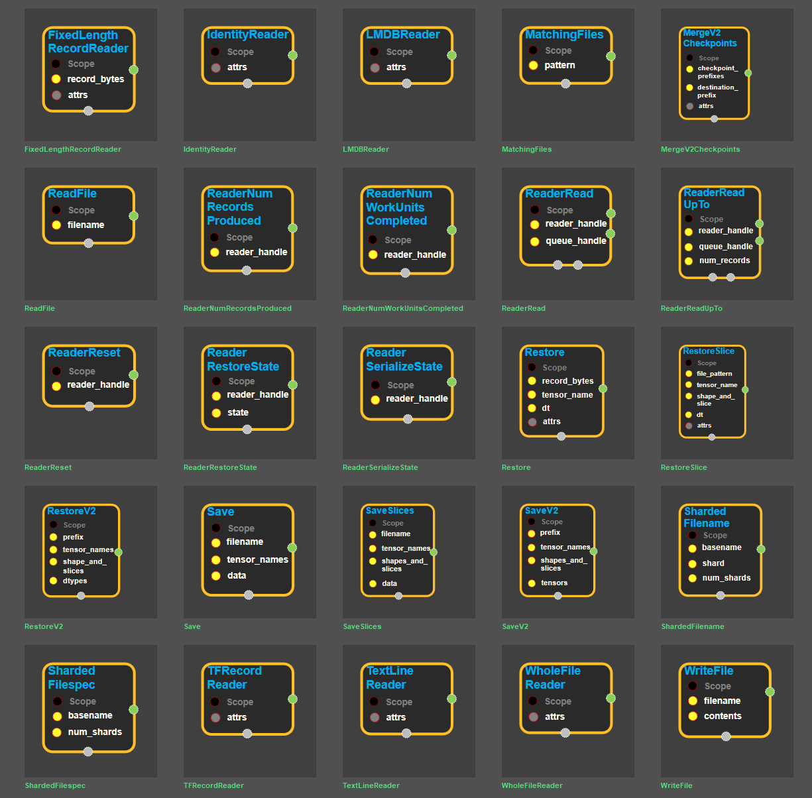
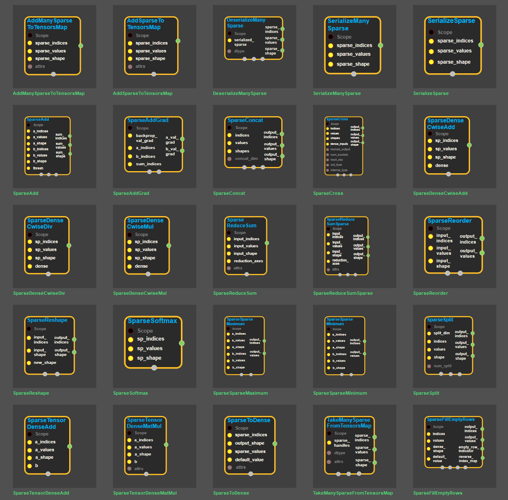
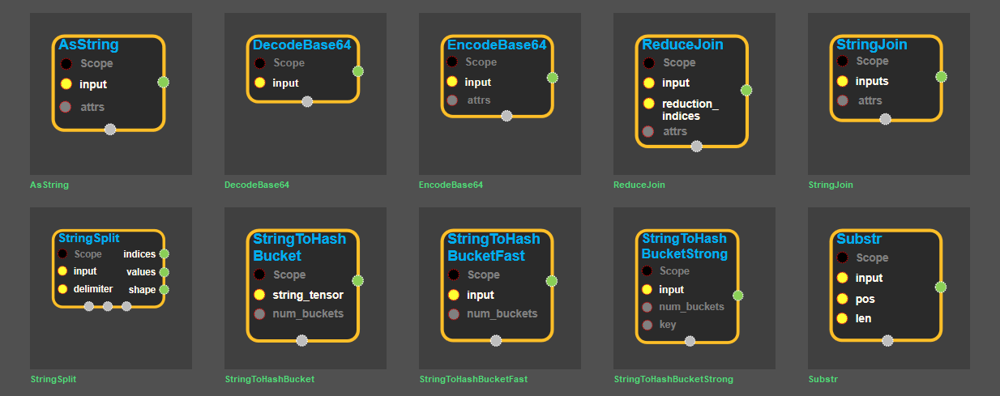

---

# enuSpace-Tensorflow API

enuSpaceTensorflow 블럭\(block\)은 tensorflow C++ 멤버의 그래픽적인 인터페이스 기능을 제공합니다. tensorflow의 C++ API와 동일한 기능을 수행하거나, 확장된 형태로 제공됩니다.

tensorflow overview : [https://www.tensorflow.org/api\_docs/cc/](https://www.tensorflow.org/api_docs/cc/)

## array\_ops

## candidate\_sampling\_ops

## control\_flow\_ops

## core

## data\_flow\_ops

## image\_ops

## io\_ops

## logging\_ops

## math\_ops

## nn\_ops

## parsing\_ops

## random\_ops

## sparse\_ops

## state\_ops

## string\_ops

## training\_ops

