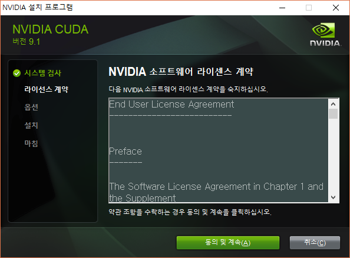

# enuSpace-Tensorflow Installation

---

enuSpace의 plugin tensorflow에 대한 설치방법에 대하여 설명합니다.

참조 : [https://expnuni.gitbooks.io/enuspace/content/enuspace-plugin.html](https://expnuni.gitbooks.io/enuspace/content/enuspace-plugin.html)

---

## enuSpace-Tensorflow 구동을 위한 준비

enuSpace의 Plug-In manager로 task 라이브러리를 다운받은 후 준비해야될 내용을 설명한다.

현재 enuSpace의 Tensorflow Plug-In은 1.5 버전으로 CUDA Tool Kit 9.1버전과 cuDNN 7.0.5 또는 7.1.2버전이 필요하다.

cuDNN은 다운받으려면 NVIDIA 회원가입이 필요하다.

CUDA 9.1v 링크 : [https://developer.nvidia.com/cuda-91-download-archive](https://developer.nvidia.com/cuda-91-download-archive)

cuDNN 다운로드 링크 : [https://developer.nvidia.com/rdp/cudnn-archive](https://developer.nvidia.com/rdp/cudnn-archive)

### CUDA 설치

CUDA파일을 다운받을 때 모든 패치를 같이 받아준다. 그리고 CUDA 베이스를 설치한 후 순서대로 설치하여 준다.

다운받은 CUDA파일은 압축 파일이므로 압축을 원하는 폴더에 풀어준다.

압축 해제가 완료되면 바로 setup파일이 실행된다.

아래와 같은 페이지가 나오면 동의 및 계속을 눌러 다음으로 넘어간다.

아래와 같은 페이지가 나오면 빠른설치\(기본값\)를 선택하고 다음으로 넘어가면 바로 설치가 시작된다.

만약 CUDA를 설치하면 CUDA를 사용할 수 있는 프로그램이 실행중일 경우\(ex: visual studio 2015\)설치시에는 해당하는 프로그램을 잠시 종료하고 설치를 진행한다.

CUDA설치가 완료된 후 패치를 1, 2, 3 순서대로 설치하면 된다.

### cuDNN 설치

cuDNN은 CUDA 설치 후 적용하는 라이브러리로 압축 해제 후 CUDA설치 폴더에 붙여넣는 설치방식이다.

CUDA v9.1기본 설치 경로 : C:\Program Files\NVIDIA GPU Computing Toolkit\CUDA\v9.1

압축 파일 실행시 아래와 같은 화면이 나온다.  

cuda 폴더 안으로 들어가면 나오는 bin, include, lib 폴더를 CUDA 9.1v이 설치된 곳에 붙여 넣어준다.  

