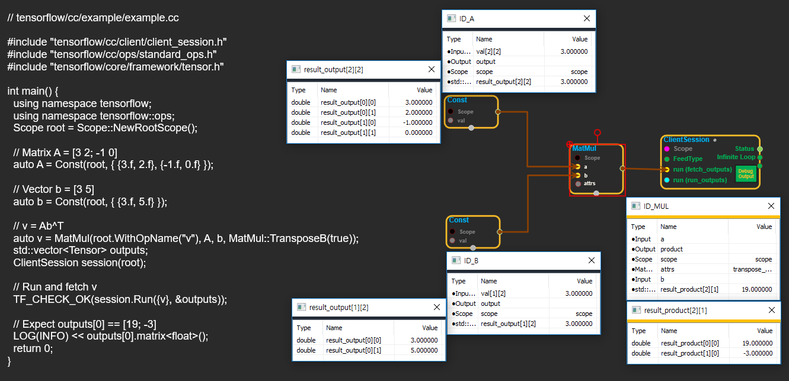
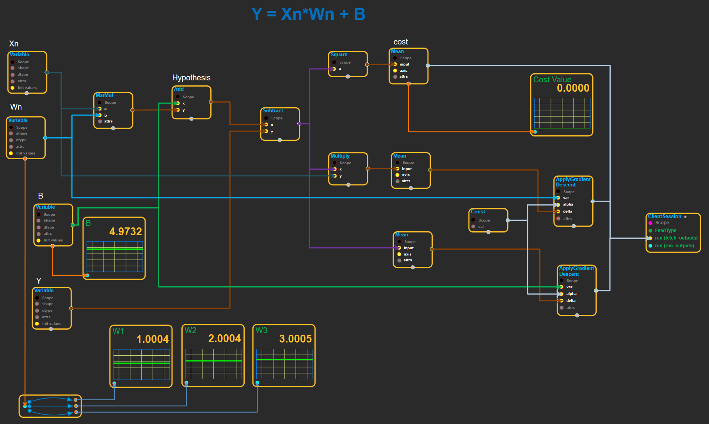
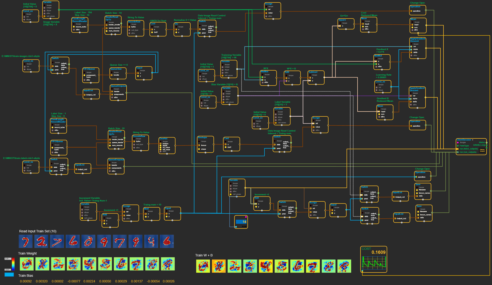
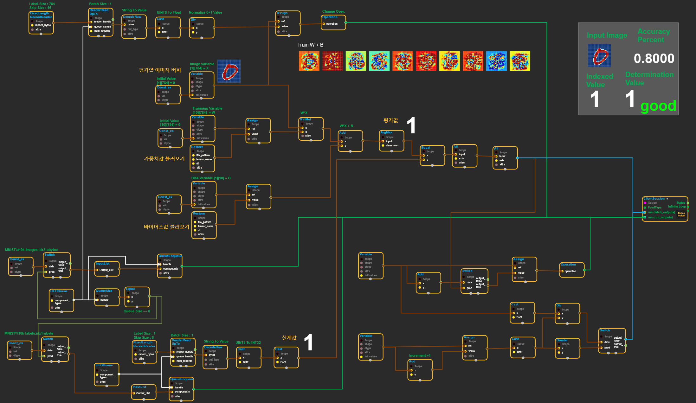
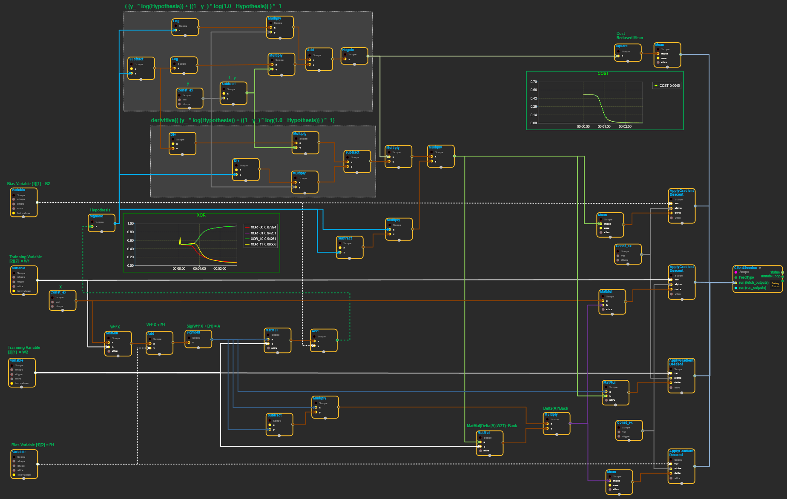

# enuSpace-Tensorflow Tutorial

---

### [Basic** 구현**](/tutorial/basic.html)

github : [model download](https://github.com/EXPNUNI/enuSpace-Tensorflow/tree/master/samples/model_samples/basic)

---

### [**Gradient Descent 알고리즘 구현**](https://expnuni.github.io/enuspace_tensorflow_doc/docs/enuspace-tensorflow-tutorial/enusttutorial_gradient-descent/)

github : [model download](https://github.com/EXPNUNI/enuSpace-Tensorflow/tree/master/samples/model_samples/gradient_descent)

---

### [MNIST linear regression 알고리즘 구현](/tutorial/mnist-linear-regression.html)

github : [model download](https://github.com/EXPNUNI/enuSpace-Tensorflow/tree/master/samples/model_samples/mnist)

#### Train Model

훈련 모델

#### Evaluation Model

평가용 모델

---

### [XOR 알고리즘 구현](/tutorial/XOR.html)

github : [model download](https://github.com/EXPNUNI/enuSpace-Tensorflow/tree/master/samples/model_samples/xor)

