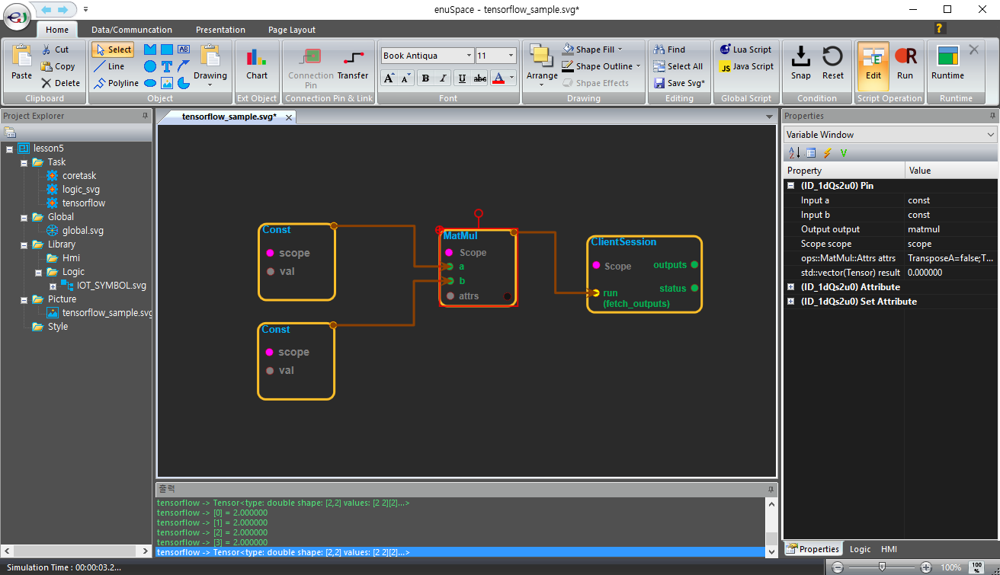

# enuSpace-Tensorflow Overview

enuSpaceTensorflow는 enuSpace에서 외부 external plugin 모듈 tensorflow를 로직 블럭\(block\)형태로 플로우 프로그래밍을 제공합니다.


enuSpaceTensorflow github : [https://github.com/EXPNUNI/enuSpaceTensorflow](https://github.com/EXPNUNI/enuSpaceTensorflow)

enuSpace blog : [http://enuspace.tistory.com/](http://enuspace.tistory.com/)

enuSpace gitbook \(guide\) : [https://expnuni.gitbooks.io/enuspace/](https://expnuni.gitbooks.io/enuspace/)

tensorflow의 C++ 코드. [Tensorflow C++ API Guide](https://www.tensorflow.org/api_guides/cc/guide)

```cpp
#include "tensorflow/cc/client/client_session.h"
#include "tensorflow/cc/ops/standard_ops.h"
#include "tensorflow/core/framework/tensor.h"

int main() 
{
  using namespace tensorflow;
  using namespace tensorflow::ops;
  Scope root = Scope::NewRootScope();

  // Matrix A = [3 2; -1 0]
  auto A = Const(root, { {3.f, 2.f}, {-1.f, 0.f}});

  // Vector b = [3 5]
  auto b = Const(root, { {3.f, 5.f}});

  // v = Ab^T
  auto v = MatMul(root.WithOpName("v"), A, b, MatMul::TransposeB(true));
  std::vector outputs;
  ClientSession session(root);

  // Run and fetch v
  TF_CHECK_OK(session.Run({v}, &outputs));

  // Expect outputs[0] == [19; -3]
  LOG(INFO) << outputs[0].matrix();
  return 0;
}
```

enuSpaceTensorflow를 이용하면 로직블럭을 이용하여 아래 그림과 같이 블럭\(block\)으로 프로그래밍을 수행할 수 있습니다.



